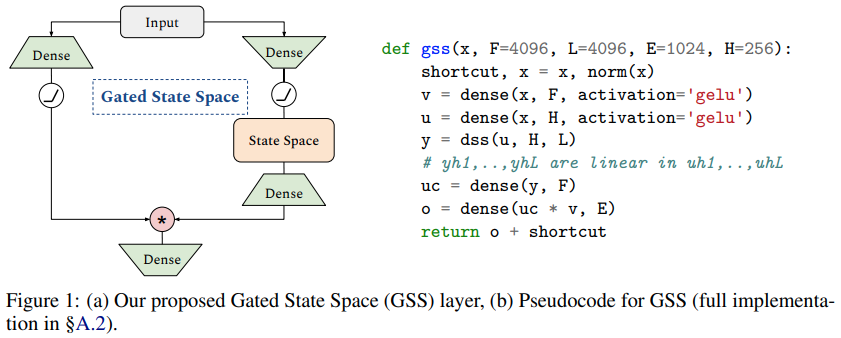

</img>

## Gated State Spaces - Pytorch

Implementation of Gated State Spaces, from the paper <a href="https://arxiv.org/abs/2206.13947">Long Range Language Modeling via Gated State Spaces</a>, in Pytorch. In particular, it will contain the hybrid version containing local self attention with the long-range GSS.

It will also contain a few more settings to compare state spaces to a sequence-wise GLU depthwise conv, and even simpler, a parameterized exponential moving average along the sequence dimension. So we get to the bottom of whether state spaces are worth it, or whether it is really all about the `O(L log(L))` FFT convolution trick. Results will be shared in the readme.

I will also pit the GSS module against the <a href="https://github.com/lucidrains/panoptic-transformer">Path-X</a> challenge and see how well it does.

## Install

```bash
$ pip install gated-state-spaces-pytorch
```

## Usage

```python
import torch
from gated_state_spaces_pytorch import GSS

gss = GSS(
    dim = 512,                  # dimension
    dim_expansion_factor = 4,   # hidden dimension (expansion factor x dim) = 2048
    dss_kernel_N = 512,
    dss_kernel_H = 256
)

x = torch.randn(1, 65536, 512)

out = gss(x) # (1, 65536, 512)
```

Gated state spaces language model

```python
import torch
from gated_state_spaces_pytorch import GatedStateSpacesLM

gss_lm = GatedStateSpacesLM(
    num_tokens = 20000,
    depth = 12,
    dim = 512,
    dim_expansion_factor = 4,
    dss_kernel_N = 512,
    dss_kernel_H = 256
)

ids = torch.randint(0, 20000, (1, 1024))

logits = gss_lm(ids) # (1, 1024, 20000)
```

## Todo

- [x] enwik8
- [x] gss lm class
- [x] add dsconv + learned ema
- [ ] add attention.

## Citations

```bibtex
@inproceedings{Mehta2022LongRL,
    title   = {Long Range Language Modeling via Gated State Spaces},
    author  = {Harsh Mehta and Ankit Gupta and Ashok Cutkosky and Behnam Neyshabur},
    year    = {2022}
}
```

```bibtex
@misc{woo2022etsformer,
    title   = {ETSformer: Exponential Smoothing Transformers for Time-series Forecasting},
    author  = {Gerald Woo and Chenghao Liu and Doyen Sahoo and Akshat Kumar and Steven Hoi},
    year    = {2022},
    eprint  = {2202.01381},
    archivePrefix = {arXiv},
    primaryClass = {cs.LG}
}
```
